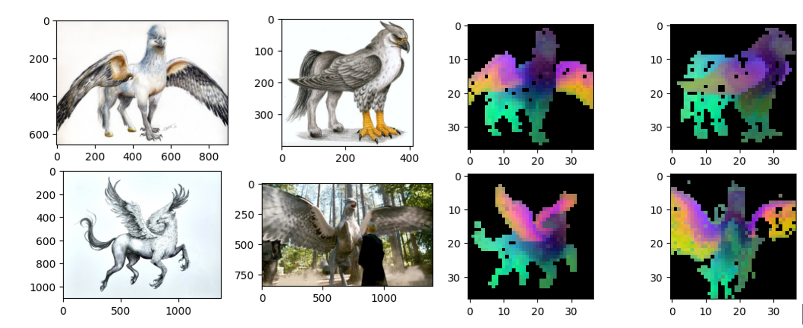
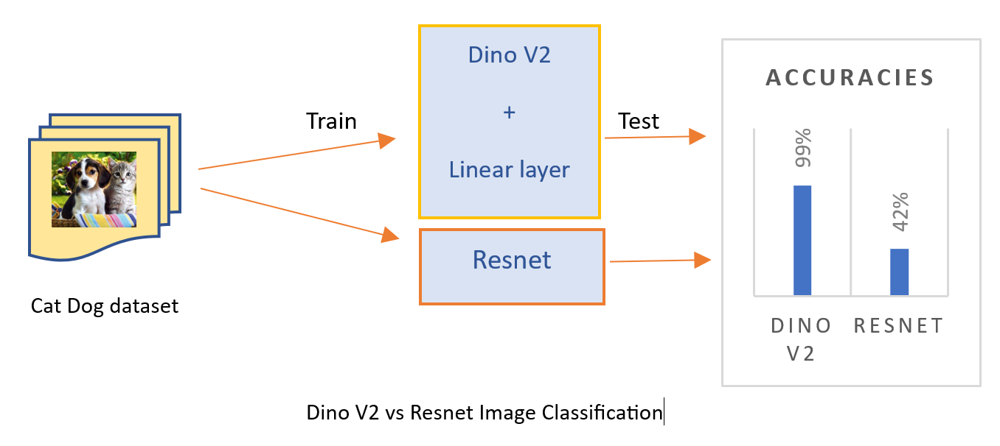
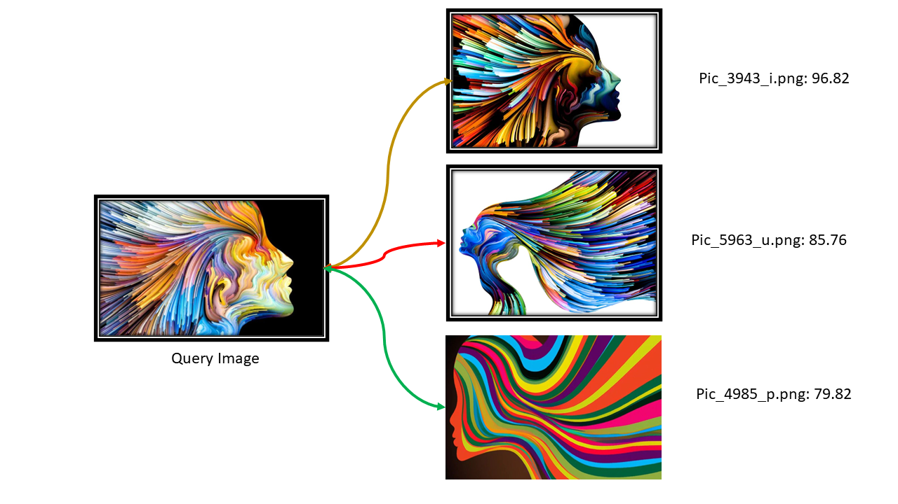

# Dino_V2
#### Learning Robust Visual Features without Supervision
Check out the paper here DINOv2: [Learning Robust Visual Features without Supervision](https://arxiv.org/abs/2304.07193)



`inspired from original Facebook Meta AI repo`.

#### 1. Feature Visualization:
- Like Mentioned in paper, I have used the features from Images using 2 step-PCA to visualize in a fashion showed in paper. The above visualization is the result of it.
#### 2. Image Classification:
- I also have used DinoV2 for Classification, and compared it with Resnets(might not be a fair comparision of transformers vs CNNs).




#### 3. Image Search/Retrieval
- I have also used DinoV2 for Image similarity, extracted image features form Database of Images, Used A Query image to query against the Database of Images. We used **FAISS** for quick Retrieval. 



#### Notes:
- Paralell Processing is not required at Faiss Search Time, since Faiss Already implements it.
- Paralell Processing at Feature creation for Database images is helpful.
- We are currently using Faiss.IndexL2 with Normalized Vectors which is Cosine Similarity, But IVFPQ(Inverted File pointer Quantization) + HNSW Of FAISS can Search Billions Of Points in MilliSeconds & Can be added Later.
- The Training/finetuning of DinoV2 on CustomData is same as training Regular computer vision models.

## CLIP: Check Out My CLIP For Image Retrieval Repo [here](https://github.com/purnasai/CLIP_Image_Retrieval) 

#### TODO:
- [X] Adding PCA Visualization
- [X] Adding DinoV2 VS Resnet Classification
- [X] Adding Faiss indexing in ImageRetrival

Please Give credits if one use this repo for any purpose. It would be helpful. Thank you

#### citation
```
@misc{oquab2023dinov2,
  title={DINOv2: Learning Robust Visual Features without Supervision},
  author={Oquab, Maxime and Darcet, Timothée and Moutakanni, Theo and Vo, Huy V. and Szafraniec, Marc and Khalidov, Vasil and Fernandez, Pierre and Haziza, Daniel and Massa, Francisco and El-Nouby, Alaaeldin and Howes, Russell and Huang, Po-Yao and Xu, Hu and Sharma, Vasu and Li, Shang-Wen and Galuba, Wojciech and Rabbat, Mike and Assran, Mido and Ballas, Nicolas and Synnaeve, Gabriel and Misra, Ishan and Jegou, Herve and Mairal, Julien and Labatut, Patrick and Joulin, Armand and Bojanowski, Piotr},
  journal={arXiv:2304.07193},
  year={2023}
}
```
